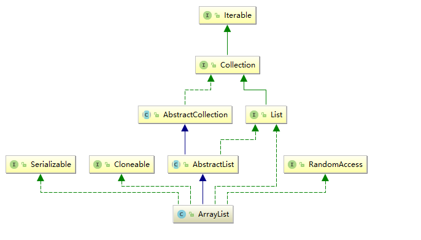

# ArrayList源码解析
## 目录
- [ArrayList是什么](#ArrayList是什么)
- [继承关系](#继承关系)  
- [成员变量](#成员变量)  
    * [DEFAULT_CAPACITY](#DEFAULT_CAPACITY)  
    * [EMPTY_ELEMENTDATA](#EMPTY_ELEMENTDATA)  
    * [DEFAULTCAPACITY_EMPTY_ELEMENTDATA](#DEFAULTCAPACITY_EMPTY_ELEMENTDATA)  
    * [elementData](#数组变量)  
    * [size](#size变量)  
    * [MAX_ARRAY_SIZE](#MAX_ARRAY_SIZE)  
    * [serialVersionUID](#serialversionuid)  
- [构造函数](#构造函数)  
- [添加数据](#添加数据)  
    * [add包括扩容的讲解](#add)  
    * [addAll](#addall)  
    * [set](#set)  
- [查找数据](#查找数据)  
    * [get](#get)  
    * [indexOf](#indexof)  
    * [lastIndexOf](#lastindexof)  
    * [contains](#contains)  
- [删除元素](#删除元素)  
    * [remove](#remove)  
    * [removeAll与retainAll](#removeall与retainall)  
- [获取ArrayList基本信息](#获取ArrayList基本信息)  
    * [size](#size)  
    * [isEmpty](#isempty)  
- [手动扩容与缩减](#手动扩容与缩减)  
    * [trimToSize](#trimtosize)  
    * [ensureCapacity](#ensurecapacity)  
- [生成对应数组](#生成对应数组)  
    * [toArray](#toarray)  
- [克隆](#克隆)  
    * [clone](#clone)  
- [释放](#释放)  
    * [clear](#clear)  
- [序列化与反序列化](#序列化与反序列化)  
    * [writeObject](#writeobject)  
    * [readObject](#readobject)  
- [forEach](#foreach)  
## ArrayList是什么
ArrayList是Java集合框架中比较常用的数据结构。是一个容量能够动态增长的数组。它继承了AbstractList抽象类，
并实现了List,RandomAccess,Cloneable,Serializable四个接口，所以ArrayList支持快速访问，克隆并且支持序列化。
## 继承关系
上面介绍了ArrayList都继承了什么实现了什么，现在我们通过一张图来了解一下ArrayList的继承关系。

## 成员变量
```java
    /**
    * 用于序列化
    */
    private static final long serialVersionUID = 8683452581122892189L;
    /**
     * 默认初始容量.
     */
    private static final int DEFAULT_CAPACITY = 10;
    /**
     * 用于空实例的共享空数组实例
     */
    private static final Object[] EMPTY_ELEMENTDATA = {};
    /**
     *
     * 用于默认大小的空实例的共享空数组实例。我们将其与空的元素数据区分开来，以了解添加第一个元素时要膨胀多少。
     * 缺省空对象数组
     * 用于无参构造方法，判断第一次添加元素时判断最小容量
     */
    private static final Object[] DEFAULTCAPACITY_EMPTY_ELEMENTDATA = {};
    /**
     *
     * 存储ArrayList元素的数组缓冲区。
     ArrayList的容量是这个数组缓冲区的长度。添加第一个元素时，任何elementData==DEFAULTCAPACITY_empty_elementData的空ArrayList都将扩展为DEFAULT_CAPACITY大小。
     */
    transient Object[] elementData; 
    /**
     * ArrayList的大小（它包含的元素数）。
     * @serial
     */
    private int size;
    // ArrayList的最大大小
    private static final int MAX_ARRAY_SIZE = Integer.MAX_VALUE - 8;
    
```
### DEFAULT_CAPACITY
ArrayList默认的初始大小，如果创建实例时使用无参构造函数就会初始化一个DEFAULT_CAPACITY(10)大小的ArrayList。  
### EMPTY_ELEMENTDATA
是个空的Object数组，用于初始化一个空的elementData(ArrayList实际储存数据的数组)
### DEFAULTCAPACITY_EMPTY_ELEMENTDATA
也是一个空的Object数组，用于判断创建ArrayList时是否给出初始大小，如何使用会在下面解释。  
也叫缺省空对象数组。  
### 数组变量
elementData  
实际存储元素的Object数组，需要注意的是它被transient修饰，在序列化反序列化时默认将忽视被transient修饰的成员变量。  
在之前我们说过ArrayList支持序列化，其实这个ArrayList为了节约资源做出的优化，ArrayList如果序列化会在下面序列化与反序列化的章节说明。 
### size变量
ArrayList的大小，这个大小是实际保存的元素的数量，而不是ArrayList的大小。
### MAX_ARRAY_SIZE
java官方描述是ArrayList的最大大小也就是Integer的最大值-8，但实际上最大并不是，最大应该是等于Integer的最大值(2的31次幂-1 = 2147483647)。
为什么扩容时会讲。
### serialVersionUID
用于序列化不多做阐述
## 构造函数
ArrayList有三个构造函数,分别是:
```java
    /**
     * 将缺省空对象数组给elementData
     */
    public ArrayList();   
    /**
     * 构造具有初始容量的空列表
     */
    public ArrayList(int initialCapacity);
    /**
     *  根据一个集合来生成一个ArrayList
     */
    public ArrayList(Collection<? extends E> c);
```
首先来说这个无参的构造函数:
```java
    /**
     * 将缺省空对象数组给elementData
     */
    public ArrayList() {
        this.elementData = DEFAULTCAPACITY_EMPTY_ELEMENTDATA;
    }
```
这个可以说是很简单了，就是将之前讲过的成员变量DEFAULTCAPACITY_EMPTY_ELEMENTDATA赋值给elementData。
之后会在第一次判断扩容的时候判断elementData是不是DEFAULTCAPACITY_EMPTY_ELEMENTDATA来决定容量大小。  
```java
    public ArrayList(int initialCapacity) {
        // 如果initialCapacity大于0就创建一个对应大小的Object数组给elementData，如果等于0就吧空数组EMPTY_ELEMENTDATA给elementData
        if (initialCapacity > 0) {
            this.elementData = new Object[initialCapacity];
        } else if (initialCapacity == 0) {
            this.elementData = EMPTY_ELEMENTDATA;
        } else {
            throw new IllegalArgumentException("Illegal Capacity: "+
                    initialCapacity);
        }
    }
```
第二个构造方法有一个initialCapacity参数，这个参数就决定了ArrayList容器的大小，如果initialCapacity大于0就new一个同样大小的
Object数组赋值给elementData。如果等于0就将空数组EMPTY_ELEMENTDATA赋值给elementData。小于0就会抛出IllegalArgumentException。
```java
    /**
     *  根据一个集合来生成一个ArrayList
     */
    public ArrayList(Collection<? extends E> c) {
        // 返回包含c集合中所有元素的数组。
        elementData = c.toArray();
        // 如果数组大小为0就初始化一个空的ArrayList
        if ((size = elementData.length) != 0) {
            // c.toArray might (incorrectly) not return Object[] (see 6260652)
            //c.toArray有可能返回的不是Object[]
            if (elementData.getClass() != Object[].class)
                // 如果不是Object[]则生成一个新的Object[]将元素放进去
                elementData = Arrays.copyOf(elementData, size, Object[].class);
        } else {
            // replace with empty array.
            this.elementData = EMPTY_ELEMENTDATA;
        }
    }
```
第三个构造方法的参数是一个接口Collection，也就是说它可以根据任意一个继承了Collection接口的类生成一个ArrayList。
首先调用Collection#toArray获取这个集合元素对应的Object数组。  
但通过官方的注释可知toArray返回也许不是Object数组所以我们在判断数组不为空之后，进行了一次类型判断，如果不为Object[].class就重新
拷贝一个Object[]赋值给elementData。
如果数组为空就直接将EMPTY_ELEMENTDATA(空数组)赋值给elementData。
## 添加数据
这个环境主要是讲解ArrayList自己的添加元素的方法，不包括ListIterator的添加方法。  
共有5个方法。
### add
add方法进行了一次重载所以有两个add方法，参数与返回值都不相同。
```java
    /**
     * 将指定元素e添加至末尾
     */
    public boolean add(E e);
    /**
     * 在指定位置插入一个元素，如果当前位置和后续有任何元素，则向右移动一个元素
     */
    public void add(int index, E element);
```
咱们先看第一个也是项目里最常用的只有一个泛型参数的add方法。
```java
    /**
     * 将指定元素e添加至末尾
     */
    public boolean add(E e) {
        // 第一次add elementData无参初始化，判断是否需要扩容，如果需要扩容就进行扩容
        ensureCapacityInternal(size + 1);  // Increments modCount!!
        // 将元素e放至末尾
        elementData[size++] = e;
        return true;
    }
```
我们可以看到add方法进来就直接调用了一个私有方法ensureCapacityInternal，我们进去看看它都做了些什么。
```java
    private void ensureCapacityInternal(int minCapacity) {
        ensureExplicitCapacity(calculateCapacity(elementData, minCapacity));
    }
```
在调用ensureExplicitCapacity之前先用elementData与minCapacity调用了私有方法calculateCapacity。
这个方法实际上就是用到之前所说的DEFAULTCAPACITY_EMPTY_ELEMENTDATA(缺省空数组)的地方
```java
    // 根据elementData获得最小容量
    private static int calculateCapacity(Object[] elementData, int minCapacity) {
        // 如果elementData是缺省空数组DEFAULTCAPACITY_EMPTY_ELEMENTDATA,则判断minCapacity与默认大小10谁大返回大的一方
        if (elementData == DEFAULTCAPACITY_EMPTY_ELEMENTDATA) {
            return Math.max(DEFAULT_CAPACITY, minCapacity);
        }
        // 如果不是则直接返回minCapacity
        return minCapacity;
    }
```
其实代码很简单就是判断elementData是不是DEFAULTCAPACITY_EMPTY_ELEMENTDATA，结合之前无参构造函数的代码。
这样就可以判断ArrayList的创建方式是不是无参构造函数了，如果是第一次添加元素时minCapacity应该为1，所以在与
DEFAULT_CAPACITY(10)比大小的时候自然会返回10，如果不是就直接返回minCapacity的大小。  
确认了calculateCapacity时做什么的之后，让我们看看ensureExplicitCapacity吧。  
这个函数主要是为了确保minCapacity比现在的容器大小更大才去扩容
```java
    // 在扩容前确保minCapacity大于现在elementData的大小
    private void ensureExplicitCapacity(int minCapacity) {
        // 操作次数增加
        modCount++;
        // overflow-conscious code
        // 判断minCapacity是否大于elementData.length,大于才去扩容
        if (minCapacity - elementData.length > 0)
            grow(minCapacity);
    }
```
代码里首先让modCount++，这条代码的意义是记录操作数组的次数，有点类似于乐观锁的作用，在后面序列化和Iterator的时候会体现出他的作用。  
在下面就是判断判断minCapacity是否大于elementData.length了，如果大于才去执行grow,现在让我们来看看grow:
```java
    /**
     * 增加容量，以确保至少可以容纳minCapacity个元素
     */
    private void grow(int minCapacity) {
        // overflow-conscious code
        // 获取现在Array的容量
        int oldCapacity = elementData.length;
        // 得到默认扩容大小 也就是原来容量的1.5倍,抹去小数
        int newCapacity = oldCapacity + (oldCapacity >> 1);
        // 如果minCapacity比默认扩容大，则扩容至minCapacity
        // 如果默认扩容更大，则扩容至默认大小
        if (newCapacity - minCapacity < 0)
            newCapacity = minCapacity;
        // 如果newCapacity大于最大值，则再去判断minCapacity是否小于最大值
        if (newCapacity - MAX_ARRAY_SIZE > 0)
            newCapacity = hugeCapacity(minCapacity);
        // minCapacity is usually close to size, so this is a win:
        // 生成一个有这原数据大小为newCapacity的数组给elementData
        elementData = Arrays.copyOf(elementData, newCapacity);
    }
```
这个就是ArrayList的扩容方法了，首先获取现在的容量。
然后计算oldCapacity + (oldCapacity >> 1)，得到的结果就是默认扩容的大小，ArrayList默认扩容为原本的1.5倍就是从这里得来的。  
然后判断传入的minCapacity与默认扩容哪个更大取最大的。
之后在与MAX_ARRAY_SIZE(ArrayList最大容量)判断，如果比最大容量大,则再进一段特殊的判断hugeCapacity。
```java
    private static int hugeCapacity(int minCapacity) {
        //如果扩容大小为负数，则抛出OutOfMemoryError
        if (minCapacity < 0) // overflow
            throw new OutOfMemoryError();
        //如果minCapacity大于最大值，则返回Integer最大值，如果不大于最大值则返回最大值
        return (minCapacity > MAX_ARRAY_SIZE) ?
                Integer.MAX_VALUE :
                MAX_ARRAY_SIZE;
    }
```
在hugeCapacity中首先判断minCapacity是否为负数如果是负数则抛出OutOfMemoryError。  
然后再次判断minCapacity是否大于MAX_ARRAY_SIZE(ArrayList最大容量),如果大于就返回Integer.MAX_VALUE。  
这之后grow里就只剩下一行代码了
```java
elementData = Arrays.copyOf(elementData, newCapacity);
```
Arrays.copyOf这个方法我觉得大家都应该很熟悉了，生成一个新的长度为newCapacity的数组并且类型与elementData相同，
再将elementData原本的元素拷贝进去，然后重新赋值给elementData。  
由于之前的hugeCapacity方法中如果大于MAX_ARRAY_SIZE会返回Integer.MAX_VALUE,所以newCapacity的最大值是Integer.MAX_VALUE，
这样也解释了之前说的ArrayList的最大容量为什么不是代码中所写的MAX_ARRAY_SIZE而是Integer.MAX_VALUE。  
讲完了扩容现在让我们回到add方法中剩下的代码：
```java
    public boolean add(E e) {
        // 第一次add elementData无参初始化，判断是否需要扩容，如果需要扩容就进行扩容
        ensureCapacityInternal(size + 1);  // Increments modCount!!
        // 将元素e放至末尾
        elementData[size++] = e;
        return true;
    }
```
在执行完ensureCapacityInternal后，就将元素放在了现在元素列表的最末尾，返回true这个add方法就结束了。

下面来看第二个add方法，有两个参数一个是index要插入的索引与element元素本身:
```java
    /**
     * 在指定位置插入一个元素，如果当前位置和后续有任何元素，则向右移动一个元素
     */
    public void add(int index, E element) {
        // 判断index是否小于size大于0
        rangeCheckForAdd(index);
        // 判断是否需要扩容，如果需要扩容就进行扩容
        ensureCapacityInternal(size + 1);  // Increments modCount!!
        // 将index索引开始以后的元素拷贝至index+1索引之后
        System.arraycopy(elementData, index, elementData, index + 1,
                size - index);
        // 将element放至index位置
        elementData[index] = element;
        // 元素数量+1
        size++;
    }
```
首先调用rangeCheckForAdd判断index是否合规：
```java
    /**
     * 判断index是否大于元素数量或者小于0
     */
    private void rangeCheckForAdd(int index) {
        if (index > size || index < 0)
            throw new IndexOutOfBoundsException(outOfBoundsMsg(index));
    }
```
然后与第一个add方法一样调用ensureCapacityInternal判断是否进行扩容并扩容  
经过ensureCapacityInternal后，调用System.arraycopy将index的位置空出来，后面的元素右移一位。  
  
最后将element放到index位置，元素数量+1。  
### addAll
addAll同样也进行了重载一共有2个方法，一个是插入到末尾的，一个是插入到指定位置的
```java
    /**
     * 将指定集合添加进列表
     */
    public boolean addAll(Collection<? extends E> c);
        /**
         * 将指定集合添加到index位置，后面的元素右移相应的数量
         */
    public boolean addAll(int index, Collection<? extends E> c)
```
先看第一个的源码吧，参数只有一个集合：
```java
    /**
     * 将指定集合添加进列表
     */
    public boolean addAll(Collection<? extends E> c) {
        // 将集合转为Object[]
        Object[] a = c.toArray();
        // 获得数组的数量
        int numNew = a.length;
        // 判断现在的元素数量+新的数组长度是否需要扩容，如果需要就进行
        ensureCapacityInternal(size + numNew);  // Increments modCount
        // 将a数组拷贝至elementData的末尾
        System.arraycopy(a, 0, elementData, size, numNew);
        // 修改元素数量
        size += numNew;
        return numNew != 0;
    }
```
由于解释过扩容了所以代码也很简单，将集合转为Object数组获取数组大小，然后给ensureCapacityInternal判断是否需要扩容，如需要则扩容。
最后直接将新数组拷贝至elementData的元素末尾，修改元素数量就结束了。  
然后看看第二个addAll：
```java
    /*
     * 将指定集合添加到index位置，后面的元素右移相应的数量
     */
    public boolean addAll(int index, Collection<? extends E> c) {
        // 判断index是否大于size或者小于0
        rangeCheckForAdd(index);
        // 获取Object[]数组
        Object[] a = c.toArray();
        // 获取数组大小
        int numNew = a.length;

        // 判断是否需要扩容
        ensureCapacityInternal(size + numNew);  // Increments modCount

        // 判断index位置后是否有元素
        int numMoved = size - index;
        if (numMoved > 0)
            // 如果有元素则后移，为新数组腾出位置
            System.arraycopy(elementData, index, elementData, index + numNew,
                    numMoved);
        // 将新数组拷贝至elementData
        System.arraycopy(a, 0, elementData, index, numNew);
        // 修改元素数量
        size += numNew;
        return numNew != 0;
    }
```
与上面指定位置的add大同小异,先判断index是否合规，然后给ensureCapacityInternal判断是否需要扩容，如需要则扩容。
然后根据size计算插入的位置是否有元素，如果有先将这个位置和后面的元素右移numNew个位置，为新元素腾出空间，然后将
新元素拷贝进elementData，修改元素数量。
### set
set方法只有一个：
```java
    /**
     * 替换指定位置元素，返回这个位置替换前的元素
     */
    public E set(int index, E element) {
        // 判断index是否大于等于元素数量
        rangeCheck(index);
        // 通过elementData获取替换前的元素
        E oldValue = elementData(index);
        // 替换元素
        elementData[index] = element;
        // 返回替换前元素
        return oldValue;
    }
```
代码基本也很简单，就简单赘述一下，rangeCheck是用来判断index是否大于等于size的方法，如果大于等于则抛出IndexOutOfBoundsException。  
检测通过之后取出当前index位置的元素，将新元素替换上去后，返回原本的元素。
## 查找数据
这里主要讲解几个查询索引与获取数据的方法，同样还是不包括ListIterator与Iterator。  
共有4个方法。
```java
    /**
     * 返回此列表中指定位置的元素。
     */
    public E get(int index);
    /**
     * 返回指定元素第一次出现的索引,如果没有则返回-1
     */
    public int indexOf(Object o);

    /**
     * 返回指定元素最后一次出现的索引,如果没有则返回-1
     */
    public int lastIndexOf(Object o);

    /**
     * 判断ArrayList中是否至少有一个元素o，如果存在返回True
     */
    public boolean contains(Object o);
```
### get
先说我们最常见的get方法讲起，还是先放源码。  
```java
    /**
     * 返回此列表中指定位置的元素。
     */
    public E get(int index) {
        // 判断index是否大于等于元素数量
        rangeCheck(index);
        // 不大于则调用elementData获得对应索引元素
        return elementData(index);
    }
```
这个源码一共只调用了两个方法，我们一个个看。 
#### rangeCheck
```java
    /**
     * 判断索引是否大于或等于元素数量如果大于等于则抛出IndexOutOfBoundsException
     */
    private void rangeCheck(int index) {
        if (index >= size)
            throw new IndexOutOfBoundsException(outOfBoundsMsg(index));
    }
```
rangeCheck仅仅就是判断了一下index是否超过或等于元素长度，如果超出就会抛出IndexOutOfBoundsException，不多赘述。  
#### elementData
```java
    // 位置取操作
    @SuppressWarnings("unchecked")
    E elementData(int index) {
        // 直接拿出elementData对应索引的元素
        return (E) elementData[index];
    }
```
elementData只进行一个操作就是取出elementData中对应索引的元素并转换为当前范型返回。  
读完这两个方法我们发现get本质上其实就是从数组中取出对应的数据，只是在前面加了一个对索引的判断而已。  
### indexOf
```java
    /**
     * 返回指定元素第一次出现的索引,如果没有则返回-1
     */
    public int indexOf(Object o) {
        // 判断o是否为null
        if (o == null) {
            // 如果为空则从头遍历elementData寻找到第一个为null的索引i返回
            for (int i = 0; i < size; i++)
                if (elementData[i]==null)
                    return i;
        } else {
            // 如果不为空则从头遍历elementData，用equals判断寻找到第一个equals返回为true的元素的索引i返回
            for (int i = 0; i < size; i++)
                if (o.equals(elementData[i]))
                    return i;
        }
        // 如果没有找到返回-1
        return -1;
    }
```
indexOf应该是最简单的一个方法之一了，只要有些java基础就能看懂，简单描述一下吧，首先判断元素是否为空，为空就去正向遍历elementData找到第一个为空的元素，
不为空就使用equals找到第一个相同的元素，最后返回索引，如果没有找到对应元素就返回-1。  
### lastIndexOf
```java
    /**
     * 返回指定元素最后一次出现的索引,如果没有则返回-1
     */
    public int lastIndexOf(Object o) {
        // 判断o是否为null
        if (o == null) {
            // 如果为空则从尾遍历elementData寻找到第一个为null的索引i返回
            for (int i = size-1; i >= 0; i--)
                if (elementData[i]==null)
                    return i;
        } else {
            // 如果不为空则从尾遍历elementData，用equals判断寻找到第一个equals返回为true的元素的索引i返回
            for (int i = size-1; i >= 0; i--)
                if (o.equals(elementData[i]))
                    return i;
        }
        // 如果没有找到返回-1
        return -1;
    }
```
lastIndexOf与indexOf几乎一摸一样只是将正向遍历改成了反向遍历。  
### contains
```java
    /**
     * 判断ArrayList中是否至少有一个元素o，如果存在返回True
     */
    public boolean contains(Object o) {
        return indexOf(o) >= 0;
    }
```
contains中直接调用了indexOf方法，只要返回值不为-1就证明elementData中有这个元素。  
## 删除元素
删除元素有4个方法其中retainAll是仅保留指定集合中的元素也会删除元素，所以也放到删除元素这里来讲。  
```java
   /**
     * 从ArrayList中删除对应位置的元素并返回它
     */
    public E remove(int index);

    /**
     * 删除第一个o元素，成功返回true，没有o元素返回false
     */
    public boolean remove(Object o);
    /**
     * 从此列表中移除指定集合中包含的所有元素。
     */
    public boolean removeAll(Collection<?> c);
    /**
     * 仅保留指定集合中的元素
     */
    public boolean retainAll(Collection<?> c);
```
### remove
一共有两个remove方法一个是以索引为参数删除指定元素并返回，另一个是以指定元素为参数在ArrayList中删除这个元素。  
先说第一个以索引为参数的remove:  
```java
    /**
     * 从ArrayList中删除对应位置的元素并返回它
     */
    public E remove(int index) {
        // 判断index是否大于等于元素数量
        rangeCheck(index);
        // 增加操作数
        modCount++;
        // 获取对应位置的元素
        E oldValue = elementData(index);
        // 获取这个元素后还有多少个元素
        int numMoved = size - index - 1;
        // 如果不为最后一个元素则用index+1和后续的元素，复制到index的位置。
        if (numMoved > 0)
            System.arraycopy(elementData, index+1, elementData, index,
                    numMoved);
        // 将最后一个元素设置为null,且size-1
        elementData[--size] = null; // clear to let GC do its work
        // 返回index位置之前的元素
        return oldValue;
    }
```
简单的逻辑，首先还是老方法rangeCheck校验index是否大于等于size，增加操作数，取出对应元素一气呵成。  
最后如果不是最后一个元素则把后面的元素左移一位后，设置size末端元素为null并size-1，返回被删除元素。  
下面看以指定元素为参数的remove:  
```java
    /**
     * 删除第一个o元素，成功返回true，没有o元素返回false
     */
    public boolean remove(Object o) {
        //为空 不为空分开处理
        if (o == null) {
            for (int index = 0; index < size; index++)
                if (elementData[index] == null) {
                    // 删除对应元素
                    fastRemove(index);
                    return true;
                }
        } else {
            for (int index = 0; index < size; index++)
                if (o.equals(elementData[index])) {
                    // 删除对应元素
                    fastRemove(index);
                    return true;
                }
        }
        return false;
    }
```
从上面一直看下来的人看到这两个for是不是很眼熟，和indexOf中的一样是为了将null元素与正常元素分开处理。没有找到对应元素就直接返回false。  
找到对应元素后就调用
#### fastRemove：
```java
    /**
     * 与remove基本相同只是没有了检测index是否越界与获取被删除的元素。
     */
    private void fastRemove(int index) {
        modCount++;
        int numMoved = size - index - 1;
        if (numMoved > 0)
            System.arraycopy(elementData, index+1, elementData, index,
                    numMoved);
        elementData[--size] = null; // clear to let GC do its work
    }
```
与第一个remove几乎一摸一样，由于是之前遍历出来的index也没有校验的必要，也不需要获取元素，所以只保留了remove中删除元素的代码。  
### removeAll与retainAll
这两个方法底层调用的是同一个私有方法所以我们一起讲:
```java
    /**
     * 从此列表中移除指定集合中包含的所有元素。
     */
    public boolean removeAll(Collection<?> c) {
        Objects.requireNonNull(c);
        return batchRemove(c, false);
    }

    /**
     * 仅保留指定集合中的元素
     */
    public boolean retainAll(Collection<?> c) {
        Objects.requireNonNull(c);
        return batchRemove(c, true);
    }
```
两个方法都是在判断指定集合不为空之后调用了batchRemove方法只是第二个参数有所不同。  
#### batchRemove
```java
    // 根据指定集合与complement对ArrayList进行操作
    // complement为false则从elementData移除指定集合中的元素
    // 为true则只保留指定集合中的元素
    private boolean batchRemove(Collection<?> c, boolean complement) {
        final Object[] elementData = this.elementData;
        // r遍历计数器
        // w保留元素计数器
        int r = 0, w = 0;
        boolean modified = false;
        try {
            for (; r < size; r++)
                if (c.contains(elementData[r]) == complement)
                    elementData[w++] = elementData[r];
        } finally {
            // 后续处理出错的情况与将不需要的元素替换为空
            // Preserve behavioral compatibility with AbstractCollection,
            // even if c.contains() throws
            // 如果r != size 则证明try代码块中的for没有正常执行完有后续没有循环到的元素
            // 将r及以后元素放至在w索引以后,并为w的计数器加上添加后的数量
            if (r != size) {
                System.arraycopy(elementData, r,
                        elementData, w,
                        size - r);
                w += size - r;
            }
            // 如果保留的元素比原本的size小，则把w以后的元素都设置为null
            if (w != size) {
                // clear to let GC do its work
                for (int i = w; i < size; i++)
                    elementData[i] = null;
                // 记录操作数
                modCount += size - w;
                // 设置size为先存元素数量
                size = w;
                // 设置返回为true
                modified = true;
            }
        }
        return modified;
    }
```
首先我们我们先看一下r与w两个int型遍历，r用于遍历数组，而w记录保留了多少个元素，boolean变量modified是我们的返回值，true代表有删除元素，false代表没有删除元素。  
先看try代码块中很简单的代码，用for遍历elementData，如果c.contains(elementData[r])==complement为true的元素就会被保留下来，由于在c集合中存在这个元素的情况下
contains会返回true所以complement传入true时保留c中存在的元素，false时删除c中存在的元素，满足条件的元素从0索引开始向后添加直到遍历结束。  
如果r != size 则证明try代码块中的for没有正常执行完有后续没有循环到的元素。将r及以后元素放至在w索引以后,并为w的计数器加上添加后的数量。  
如果w != size证明保留的元素比原本的size小，则把w以后的元素都设置为null，并且只有在删除了元素的情况下modified才会被设置为true。  
## 获取ArrayList基本信息
### size
### isEmpty
算是基本信息的接口应该只有两个功能也差不多一个是获取size的大小，一个是判断当前ArrayList是否为空：
```java
    /**
     * 返回元素数量，不是ArrayList的容量
     */
    public int size() {
        return size;
    }

    /**
     * 判断ArrayList是否为空，判断的也是元素量不是容量
     */
    public boolean isEmpty() {
        return size == 0;
    }
```
两个几乎不用脑子的源码，不做解释。  
## 手动扩容与缩减
关于ArrayList能够调用的与容量相关的方法有两个：
```java
    /**
     * 将ArrayList的实际容量调整为与数组内数据数量相同的大小
     */
    public void trimToSize();
    /**
     * 将ArrayList扩容至minCapacity大小
     */
    public void ensureCapacity(int minCapacity);
```
### trimToSize
trimToSize的作用是将ArrayList的实际容量缩小至与元素数相同。  
也就是说我们有10个元素，由于动态扩容的原因我们的实际容量是15，调用trimToSize之后实际容量也会缩小至10。  
下面来看一下源码:
```java
    /**
     * 将ArrayList的实际容量调整为与数组内数据数量相同的大小
     */
    public void trimToSize() {
        // 操作次数增加
        modCount++;
        // 先判断数据数量是否小于实际容量，如果不小于就没有调整的必要
        if (size < elementData.length) {
            // 如果大小为0就直接赋值一个空数组，如果不为0就生成一个相同大小的数组
            elementData = (size == 0)
                    ? EMPTY_ELEMENTDATA
                    : Arrays.copyOf(elementData, size);
        }
    }
```
首先还是惯例的增加操作次数，然后判断size是否小于实际容量，如果实际容量不大于size的话就没有必要缩减容量了。  
最后判断size是否等于0，如果为0就直接给他一个我们默认的空数组，如果不为零就copy一个size大小的elementData赋值回去。  
### ensureCapacity
手动进行ArrayList的扩容操作，但也许ArrayList并不会扩容至你希望的大小，为什么会在下面的源码中讲述。  
```java
    /**
     * 将ArrayList扩容至minCapacity大小
     * 如果minCapacity小于默认扩容大小则扩容至默认扩容大小
     *
     * @param   minCapacity   the desired minimum capacity
     */
    public void ensureCapacity(int minCapacity) {
        // 判断elementData是否为缺省数组，保证无参构造函数创建的为默认大小minExpand
        int minExpand = (elementData != DEFAULTCAPACITY_EMPTY_ELEMENTDATA)
                // any size if not default element table
                ? 0
                // larger than default for default empty table. It's already
                // supposed to be at default size.
                : DEFAULT_CAPACITY;

        // 如果minCapacity指定的大小小于minExpand还是扩容至minExpand大小
        if (minCapacity > minExpand) {
            ensureExplicitCapacity(minCapacity);
        }
    }
```
首先由于ArrayList的初始策略是分为有参与无参所以会先根据初始化策略获得一个默认扩容的基数，无参为10，有参为0。  
然后用这个基数做比较，哪个大才以哪个为准。比如说你是无参构造函数创建的ArrayList，但你想给他扩容至5，调用了ensureCapacity(5)，但他依然会扩充至10。  
如果是初始化elementData过后再来扩容同样会与ArrayList的默认扩容做比较，扩容大的那个，为什么请去查看ensureExplicitCapacity的方法解析。  
## 生成对应数组
也就是toArray方法，在ArrayList中一共有两个：
```java
   /**
     * 返回一个包含全部元素且大小与元素数量相同的Object[]
     */
    public Object[] toArray();
    
    /**
     * 传入一个泛型数组，将元素全部填充进去后返回
     */
    @SuppressWarnings("unchecked")
    public <T> T[] toArray(T[] a);
    
```
### toArray
先看最简单的返回Object[]的那个:
```java
    /**
     * 返回一个包含全部元素且大小与元素数量相同的Object[]
     */
    public Object[] toArray() {
        return Arrays.copyOf(elementData, size);
    }
```
不多说一眼懂。  
再看返回范型的toArray：
```java
    /**
     * 传入一个泛型数组，将元素全部填充进去后返回
     */
    @SuppressWarnings("unchecked")
    public <T> T[] toArray(T[] a) {
        // 当a的长度小于size会直接将elementData生成一个大小为size的符合泛型的数组返回
        // 防止报错ArrayIndexOutOfBoundsException
        if (a.length < size)
            // Make a new array of a's runtime type, but my contents:
            return (T[]) Arrays.copyOf(elementData, size, a.getClass());
        //使用System.arraycopy将elementData拷贝进a，元素不会被克隆
        System.arraycopy(elementData, 0, a, 0, size);
        //如果a.length大于size，size索引的位置会被设置为null
        if (a.length > size)
            a[size] = null;
        return a;
    }
```
首先我们先判断这个传入的数组a的长度能否容纳我们的元素如果a的长度没有size大，那就新建一个对应范型的数组放入所有元素后返回。  
如果a.length不小于size那么会用System.arraycopy将elementData中的元素复制进a。并且如果a.length大于size，a数组的size索引位置会被设置为null。  
## 克隆
由于原本的克隆只能克隆基础数据类型，比如Object[]如果直接使用原本的克隆，新的ArrayList里面的elementData的内存引用和原来的ArrayList是相同的。
所以ArrayList实现了Cloneable重写了clone。
### clone
```java
    /**
     * 克隆一个ArrayList，浅克隆 elementData中的元素不会被克隆
     */
    public Object clone() {
        try {
            // 克隆一个ArrayList
            ArrayList<?> v = (ArrayList<?>) super.clone();
            // 克隆一个大小与元素数量一样的elementData,给克隆出来的ArrayList
            // 由于Arrays.copyOf也只是生成一个新的数组，没有克隆数组中的元素，所以元素不会被克隆
            v.elementData = Arrays.copyOf(elementData, size);
            // 重置操作次数
            v.modCount = 0;
            return v;
        } catch (CloneNotSupportedException e) {
            // this shouldn't happen, since we are Cloneable
            throw new InternalError(e);
        }
    }
```
首先调用了父类的clone克隆基础数据类型比如size，然后使用Arrays.copyOf生成一个全新的数组将元素放进去，注意elementData中的元素并没有被克隆。  
最后重置操作次数。  
## 释放
ArrayList提供了释放储存元素的方法：
### clear
```java
    /**
     * 释放ArrayList
     */
    public void clear() {
        // 增加操作数
        modCount++;

        // clear to let GC do its work
        // 将elementData所有的位置设置为null
        for (int i = 0; i < size; i++)
            elementData[i] = null;
        // 设置元素数量为0
        size = 0;
    }
```
还是先增加操作次数，然后将elementData中的所有元素都设为空，将元素数设置为0。  
## 序列化与反序列化
还记得我们一开始说的elementData被transient修饰，但ArrayList却支持序列化么，现在就要到源码中看一下他是如何进行序列化的了。 
 ```java
    /**
     * 序列化方法
     */
    private void writeObject(java.io.ObjectOutputStream s);

    /**
     * 反序列化
     */
    private void readObject(java.io.ObjectInputStream s);
```
### writeObject
```java
    /**
     * 序列化方法
     */
    private void writeObject(java.io.ObjectOutputStream s)
            throws java.io.IOException{
        // Write out element count, and any hidden STUFF
        // 记录操作数
        int expectedModCount = modCount;
        // 将当前类中可以序列化的字段写入s流
        s.defaultWriteObject();

        // Write out size as capacity for behavioural compatibility with clone()
        // 将容量写入流
        s.writeInt(size);

        // Write out all elements in the proper order.
        // 按正确的顺序将存在的元素写入流
        for (int i=0; i<size; i++) {
            s.writeObject(elementData[i]);
        }
        // 如果在序列化过程中操作过ArrayList，则expectedModCount != modCount
        // 抛出ConcurrentModificationException
        if (modCount != expectedModCount) {
            throw new ConcurrentModificationException();
        }
    }
```
我们先来看一下序列化方法，在之前我们只进行记录操作的modCount终于要第一次发挥他的作用了，首先我们先记录一下当前的modCount。  
然后调用defaultWriteObject方法将没有被静态修饰和没有被transient修饰的变量写入到流当中。  
然后将size写入流(其实写入size看起来意义不大，因为之前defaultWriteObject已经将size写进流了，有知道的希望能评论讨论一下)  
然后将elementData按顺序写入流，仅写入实际的元素，不写入扩容出的多余数组容量，这就是为什么elementData会用transient修饰的原因，为了优化序列化的过程。  
最后monCount也发挥了他的作用，如果在序列化过程中ArrayList发生了修改，那么的结果也可能是错误的，所以如果在最后判断如果在过程中有对ArrayList进行了修改就会抛出ConcurrentModificationException。  
### readObject
```java
    /**
     * 反序列化
     */
    private void readObject(java.io.ObjectInputStream s)
            throws java.io.IOException, ClassNotFoundException {
        // 初始一个空elementData
        elementData = EMPTY_ELEMENTDATA;
        // Read in size, and any hidden stuff
        // 从流中读取这个类中可以序列化的字段写入这个类
        s.defaultReadObject();
        // Read in capacity
        // 取出容量
        s.readInt(); // ignored
        if (size > 0) {
            // be like clone(), allocate array based upon size not capacity
            // 确认ArrayList的容量,实际上一定会返回size
            int capacity = calculateCapacity(elementData, size);
            SharedSecrets.getJavaOISAccess().checkArray(s, Object[].class, capacity);
            ensureCapacityInternal(size);
            Object[] a = elementData;
            // Read in all elements in the proper order.
            for (int i=0; i<size; i++) {
                a[i] = s.readObject();
            }
        }
    }
```
反序列化就像它的名字一样，与序列化做的是相反的事情，序列化是将数据放入到流中，而它是将数据从流中取出来。  
需要注意的是，取出的顺序一定要和存入数据相同，所以我们对应序列化的defaultWriteObject优先调用了defaultReadObject。  
然后调用了readInt与writeInt对应，判断size大小，再调用calculateCapacity与ensureCapacityInternal为数组扩容，最后对应序列化的写入操作，把数据取出来。  
## forEach
forEach这个方法的参数是Consumer也就是lambda表达式。  
这个方法是这样使用的:
```java
i.forEach((x)->{System.out.println(x)});
```
你的遍历的元素会成为x，执行后面箭头所指向的方法块。  
如果不是很能理解lambda表达式就让给我们来看一下Consumer这个接口。  
```java
@FunctionalInterface
public interface Consumer<T> {
    void accept(T t);
    default Consumer<T> andThen(Consumer<? super T> after) {
        Objects.requireNonNull(after);
        return (T t) -> { accept(t); after.accept(t); };
    }
}
```
这个接口只有两个方法一个抽象方法一个默认方法。  
其实这是java对于函数式编程的规范传入lambda表达式的对象只能有一个抽象方法。  
这样其实大家就明白了你传入的那个代码块其实就是实现了Consumer中的accept方法。  
因为forEach也可以这样使用：
```java
        i.forEach(new Consumer<Integer>() {
            @Override
            public void accept(Integer integer) {
                System.out.println(integer);
            }
        });
```
在理解了Consumer之后再来看forEach就简单多了：
```java
    /**
     * 对每一个元素进行指定的操作action,直到所有元素都处理完或者发生异常，除非另有指定
     * @param action
    */
    @Override
    public void forEach(Consumer<? super E> action) {
        Objects.requireNonNull(action);
        final int expectedModCount = modCount;
        @SuppressWarnings("unchecked")
        final E[] elementData = (E[]) this.elementData;
        final int size = this.size;
        for (int i=0; modCount == expectedModCount && i < size; i++) {
            action.accept(elementData[i]);
        }
        if (modCount != expectedModCount) {
            throw new ConcurrentModificationException();
        }
    }
```
首先判断传入的action是否为空，然后记录操作数。获取元素与元素数量，遍历执行accept方法。  
其中需要注意的是for中的modCount == expectedModCount这意味着如果在forEach的时候操作了ArrayList。
forEach就会被终止，抛出ConcurrentModificationException。  


